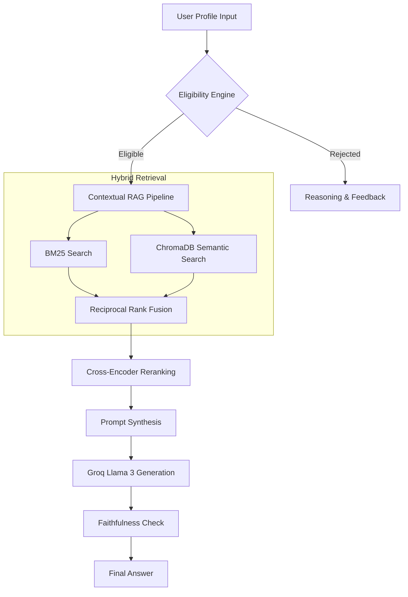

# 🇮🇳 YojanaIQ: Intelligent Welfare Navigator for Andhra Pradesh

[](https://opensource.org/licenses/MIT)
[](https://www.python.org/downloads/)
[](https://reactjs.org/)
[](https://fastapi.tiangolo.com/)
[](https://groq.com/)

**YojanaIQ** is a state-of-the-art AI-powered platform designed to empower citizens of Andhra Pradesh by simplifying the discovery and understanding of government welfare schemes. By combining a deterministic **Eligibility Engine** with a sophisticated **Hybrid RAG Pipeline**, YojanaIQ ensures that users receive factual, grounded, and personalized information.

---

## ✨ Key Features

- 🤖 **Hybrid Reranked RAG**: Combines BM25 keyword search and ChromaDB semantic search with Cross-Encoder reranking for pinpoint accuracy.
- ✅ **Deterministic Eligibility**: A rule-based engine prevents LLM hallucinations by verifying eligibility parameters (Age, Income, Caste, etc.) against local policy.
- 💬 **Multi-Channel Engagement**: Access via a premium **Web Portal** or an interactive **Telegram Bot**.
- 🌍 **Multi-Lingual Support**: Get answers in **English**, **Telugu**, or **Hindi**.
- 🔒 **Privacy First**: Personalized data is used locally to refine eligibility without being stored permanently.

---

## 🏗️ System Architecture

The core of YojanaIQ lies in its dual-stage processing pipeline:



---

## 🛠️ Tech Stack

- **Backend**: Python, FastAPI, Telegram Bot API.
- **Frontend**: React, Vite, TailwindCSS (Dark/Premium Aesthetics).
- **AI/LLM**: Groq (Llama 3.1 70B), Sentence-Transformers.
- **Vector DB**: ChromaDB.
- **Deployment**: Docker, Render (Backend), Vercel (Frontend).

---

## 🚀 Getting Started

### Prerequisites
- Python 3.10+
- Node.js & npm
- [Groq API Key](https://console.groq.com/)
- [Telegram Bot Token](https://t.me/BotFather)

### Local Setup

1. **Clone the Repository**
   ```bash
   git clone https://github.com/VishnuVardhanVelpula/yojanaIQ.git
   cd yojanaIQ
   ```

2. **Backend Setup**
   ```bash
   # Create virtual environment
   python -m venv venv
   source venv/bin/activate  # Windows: venv\Scripts\activate
   
   # Install dependencies
   pip install -r requirements.txt
   
   # Setup environment variables
   cp .env.example .env
   # Edit .env with your GROQ_API_KEY and TELEGRAM_BOT_TOKEN
   ```

3. **Initialize Database**
   ```bash
   python embed.py
   python embed_bm25.py
   ```

4. **Frontend Setup**
   ```bash
   cd frontend
   npm install
   npm run dev
   ```

---

## 📦 Deployment

This project is optimized for deployment using the included `Dockerfile` and `start.sh`.

1. **Backend**: Deploy to **Render** or **Railway** using the provided Docker configuration.
2. **Frontend**: Deploy the `frontend/` directory to **Vercel** or **Netlify**. Ensure `VITE_API_URL` is set to your deployed backend URL.

Refer to [DEPLOYMENT_GUIDE.md](DEPLOYMENT_GUIDE.md) for step-by-step cloud setup.

---

## 📄 License
This project is licensed under the MIT License - see the [LICENSE](LICENSE) file for details.

---

Developed with ❤️ for the citizens of Andhra Pradesh.
